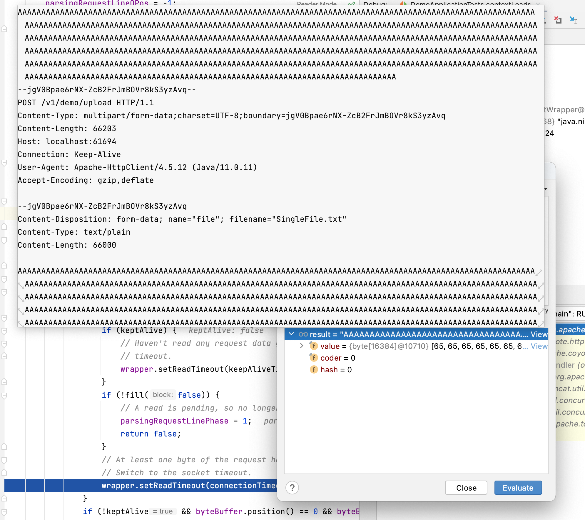

# README

Demonstration for Spring Test Bug. See: [spring-projects/spring-boot#27143](https://github.com/spring-projects/spring-boot/issues/27143).

## Reproduction

Run `mvn clean test` one or more times, and you will see the following exception:

```shell
2021-07-02 21:26:49.921  INFO 25652 --- [o-auto-1-exec-1] o.apache.coyote.http11.Http11Processor   : Error parsing HTTP request header
 Note: further occurrences of HTTP request parsing errors will be logged at DEBUG level.

java.lang.IllegalArgumentException: Invalid character found in method name [AAAAAAAAAAAAAAAAAAAAAAAAAAAAAAAAAAAAAAAAAAAAAAAAAAAAAAAAAAAAAAAAAAAAAAAAAAAAAAAAAAAAAAAAAAAAAAAAAAAAAAAAAAAAAAAAAAAAAAAAAAAAAAAAAAAAAAAAAAAAAAAAAAAAAAAAAAAAAAAAAAAAAAAAAAAAAAAAAAAAAAAAAAAAAAAAAAAAAAAAAAAAAAAAAAAAAAAAAAAAAAAAAAAAAAAAAAAAAAAAAAAAAAAAAAAAAAAAAAAAAAAAAAAAAAAAAAAAAAAAAAAAAAAAAAAAAAAAAAAAAAAAAAAAAAAAAAAAAAAAAAAAAAAAAAAAAAAAAAAAAAAAAAAAAAAAAAAAAAAAAAAAAAAAAAAAAAAAAAAAAAAAAAAAAAAAAAAAAAAAAAAAAAAAAAAAAAAAAAAAAAAAAAAAAAAAAAAAAAAAAAAAAAAAAAAAAAAAAAAAAAAAAAAAAAAAAAAAAAAAAAAAAAAAAAAAAAAAAAAAAAAAAAAAAAAAAAAAAAAAAAAAAAAAAAAAAAAAAAAAAAAAAAAAAAAAAAAAAAAAAAAAAAAAAAAAAAAAAAAAAAAAAAAAAAAAAAAAAAAAAAAAAAAAAAAAAAAAAAAAAAA0x0d0x0a--6hXCZ7NXvctrRhMdQfCslrHNTVm930eH--0x0d0x0aPOST]. HTTP method names must be tokens
	at org.apache.coyote.http11.Http11InputBuffer.parseRequestLine(Http11InputBuffer.java:417) ~[tomcat-embed-core-9.0.39.jar:9.0.39]
	at org.apache.coyote.http11.Http11Processor.service(Http11Processor.java:261) ~[tomcat-embed-core-9.0.39.jar:9.0.39]
	at org.apache.coyote.AbstractProcessorLight.process(AbstractProcessorLight.java:65) ~[tomcat-embed-core-9.0.39.jar:9.0.39]
	at org.apache.coyote.AbstractProtocol$ConnectionHandler.process(AbstractProtocol.java:868) ~[tomcat-embed-core-9.0.39.jar:9.0.39]
	at org.apache.tomcat.util.net.NioEndpoint$SocketProcessor.doRun(NioEndpoint.java:1590) ~[tomcat-embed-core-9.0.39.jar:9.0.39]
	at org.apache.tomcat.util.net.SocketProcessorBase.run(SocketProcessorBase.java:49) ~[tomcat-embed-core-9.0.39.jar:9.0.39]
	at java.base/java.util.concurrent.ThreadPoolExecutor.runWorker(ThreadPoolExecutor.java:1128) ~[na:na]
	at java.base/java.util.concurrent.ThreadPoolExecutor$Worker.run(ThreadPoolExecutor.java:628) ~[na:na]
	at org.apache.tomcat.util.threads.TaskThread$WrappingRunnable.run(TaskThread.java:61) ~[tomcat-embed-core-9.0.39.jar:9.0.39]
	at java.base/java.lang.Thread.run(Thread.java:829) ~[na:na]
```

## Issue

This test is uploading a 66K file as a multi-part form upload.

What appears to be happening is that when files over 65K are uploaded this way the contents of the body in the buffer gets shifted around when it's sent over the wire. 

The request body should look like this:

```
POST /v1/demo/upload HTTP/1.1
Content-Type: multipart/form-data;charset=UTF-8;boundary=jgV0Bpae6rNX-ZcB2FrJmBOVr8kS3yzAvq
Content-Length: 66203
Host: localhost:61694
Connection: Keep-Alive
User-Agent: Apache-HttpClient/4.5.12 (Java/11.0.11)
Accept-Encoding: gzip,deflate

--jgV0Bpae6rNX-ZcB2FrJmBOVr8kS3yzAvq
Content-Disposition: form-data; name="file"; filename="SingleFile.txt"
Content-Type: text/plain
Content-Length: 66000

AAAAAAA...<66,000x A>...AAAAAAA
--jgV0Bpae6rNX-ZcB2FrJmBOVr8kS3yzAvq--
```

However with this reproduction, the last portion of the body gets shifted to the beginning of the request. Looks like this:

```
AAAAAAAAAA
--jgV0Bpae6rNX-ZcB2FrJmBOVr8kS3yzAvq--
POST /v1/demo/upload HTTP/1.1
Content-Type: multipart/form-data;charset=UTF-8;boundary=jgV0Bpae6rNX-ZcB2FrJmBOVr8kS3yzAvq
Content-Length: 66203
Host: localhost:61694
Connection: Keep-Alive
User-Agent: Apache-HttpClient/4.5.12 (Java/11.0.11)
Accept-Encoding: gzip,deflate

--jgV0Bpae6rNX-ZcB2FrJmBOVr8kS3yzAvq
Content-Disposition: form-data; name="file"; filename="SingleFile.txt"
Content-Type: text/plain
Content-Length: 66000

AAAAAAAAAAA...<66,000x A>...
```

The above results in a malformed HTTP request that Tomcat is unable to parse. This results in the `Invalid character found in method name` error observed above.

This can be further observed by placing a breakpoint in `Http11InputBuffer::parseRequestLine` and watching contents of the `byteBuffer` as it's read from the socket.


